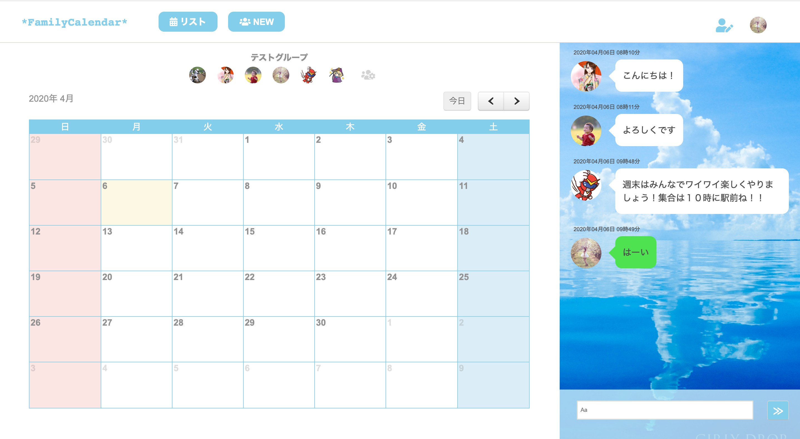

# 概要
プログラミングスクール・テックキャンプ在学中に作成したグループチャットができるカレンダー共有アプリ。 
未完成状態ではあるが、初めて個人で手掛けた作品であるため公開する。

  

 

# 開発状況
開 発 環 境：Ruby/Ruby on Rails/MySQL/Github/AWS/Visual Studio Code/haml&Scss/javaScript 
開 発 期 間：約2週間 
平均作業時間：約10時間 
開 発 体 制：1名

# 本番環境
URL http://3.114.135.98/

ID: admin 
Pass: 2222

テスト用アカウント 
メールアドレス: testuser@info.com 
パスワード: testuser

# 動作確認方法
Chromeの最新版を利用してアクセスしてください。 
ただしデプロイ等で接続できないタイミングもございます。その際は少し時間をおいてから接続ください。 
接続先およびログイン情報については、上記の通りです。 
同時に複数の方がログインしている場合に、ログインできない可能性がございます。 

以下の手順で確認できます 
テストアカウントでログイン→トップページからリストボタン押下→ハンバーガーメニューのテストユーザー用グループ押下 

確認後、ログアウト処理をお願いします。

# 制作意図
現在、子育て世代にはカレンダーアプリによるスケジュール共有がマストアイテムとなっている。我が家でも夫婦でタイムツリーを利用しているが、コメント機能が少し使いづらく、スケジュールの確認や調整はその都度、LINEで行っており、アプリの切り替えがめんどくさかった。 
そこで、グループカレンダー機能＋チャット機能が１つのビューで見ることができれば、上記の使いづらさ解消につながるのではないかと感じ、このアプリ制作を企画した。

# DEMO

# 機能
１）ユーザー登録・編集
２）グループ登録・編集
３）カレンダー表示・イベント投稿 ※fullcalendar利用
４）グループチャット機能

# 工夫したポイント
・チャットとカレンダーを同じビューで表示させる。
・GroupテーブルとMessageテーブルのアソシエーションのため、ビューを２つ用意しgroupコントローラーとmessageコントローラーに対応できるようにした。
・勉強のため、ライブラリの積極的な使用（ユーザー、グループの登録・編集 ▶︎ devise／カレンダー ▶︎ fullcalendar）
・チャット画面（アイコン表示、吹き出し、自分の投稿は緑色）

# 課題や今後実装したい機能
## 課題
Ruby on Rails（特にMVC)の理解が浅い段階で企画してしまったため、DB設計が甘かった。 
また2週間という限られた時間の中で、自分の技量よりも企画が先行してしまい、最低限の機能の実装となってしまった。 
ライブラリは非常に便利だが、序盤はQiita記事など２次情報を参考にしたため、実装に時間がかかってしまった。一次情報の大切さを実感し、英語力の向上が必要だと痛感した。 
サーバーサイドのコーディング技術。またJavaScriptの理解。

## 改善点・実装したい機能
１）グループごとにカレンダーのイベントを登録
２）非同期通信
３）自動更新
４）オートスクロール
５）グループid１のグループしか編集できない
６）グループ作成・編集ページに戻るボタン

# DB設計

## usersテーブル
|Column|Type|Options|
|------|----|-------|
|name|string|null: false|
|image|img||
|email|string|null: false|
|password|string|null: false|

### Association
- has_many :messages
- has_many :user_groups
- has_many :groups,  through:  :user_groups

## groupsテーブル
|Column|Type|Options|
|------|----|-------|
|name|string|null: false|

### Association
- has_many :messages
- has_many :user_groups
- has_many :users, through:  :user_groups
- belongs_to :calendar

## user_groups
|Column|Type|Options|
|------|----|-------|
|user-id|integer|null: false, foreign_key: true|
|group-id|integer|null: false, foreign_key: true|

### Association
- belongs_to :user
- belongs_to :group

## events
|Column|Type|Options|
|------|----|-------|
|event|string|null: false|
|date|string|null: false|
|time|string|null: false|
|group-id|integer|null: false, foreign_key: true|

### Association
- belongs_to :group

## messages
|Column|Type|Options|
|------|----|-------|
|comment|text|null: false|
|image|img||
|user-id|integer|null: false, foreign_key: true|
|group-id|integer|null: false, foreign_key: true|

### Association
- belongs_to :user
- belongs_to :group